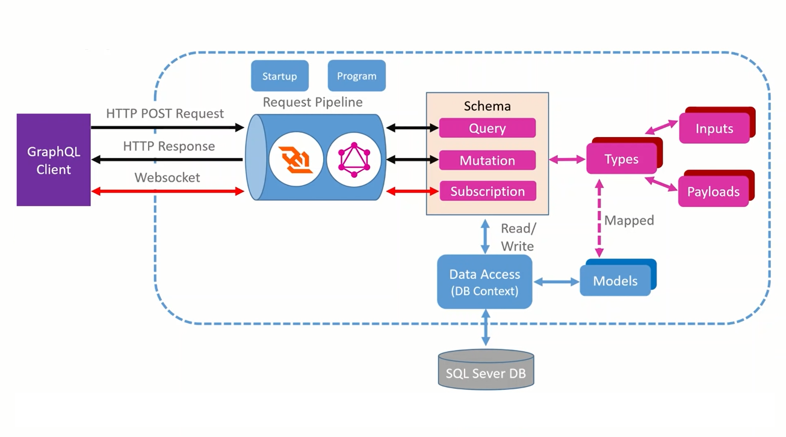

## What 

In this step-by-step tutorial I take you through how build a GraphQL API using C#9, .NET 5 and the Hot Chocolate framework.

## Covers:

- Application Architecture Overview
- GraphQL theory and core concepts
- Building Queries
- Multi-threaded queries using Pooled DBContextFactory
- Sorting & Filtering
- Building Mutations
- Building Subscriptions (real-time event notifications with Web Sockets)

## Application Architecture

